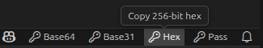
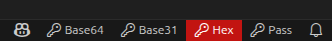

# Key Generator

A Visual Studio Code extension to quickly generate cryptographically secure keys and strong passwords.

## Features

-   **Cryptographically Secure**: Uses Node.js `crypto.randomBytes()` and `crypto.randomInt()` for true random generation
-   **Multiple Formats**: Generate keys in hexadecimal, base31, or base64url, or strong passwords
-   **Status Bar Integration**: Subtle, always-accessible buttons in the VS Code status bar
-   **Clipboard Monitoring**: Blinks red while the key is still in your clipboard
-   **One-Click Clearing**: Click the blinking button again to clear it
-   **Security First**: No key/password storage or logging - data exists only in memory and inyour clipboard

## Usage

### Generate Keys and Passwords

Four buttons appear in the bottom-right status bar:

-   **Hex**: Generates hexadecimal key (256-bit default)
-   **Base31**: Generates a base31-encoded key (256-bit default)
-   **Base64url**: Generates a base64url-encoded key (256-bit default)
-   **Password**: Generates a password (20 character default with uppercase, lowercase, number, and special characters included)

Click any button to generate a new key and copy it to your clipboard:

When a key is generated, the button blinks red to warn you that it's still in your clipboard. Click it again to clear the clipboard:

## Settings

Access settings via `File > Preferences > Settings` and search for "Key Generator". Settings are available for key length, password length and complexity, and button visibility.

## Attribution

Developed by **Cyberclast Software Solutions Ltd.**

Website: [https://cyberclast.com](https://cyberclast.com)

## License

MIT License - See LICENSE file for details

## Support

For issues, feature requests, or contributions, please visit the [GitHub repository](https://github.com/cyberclast/gen-key).
